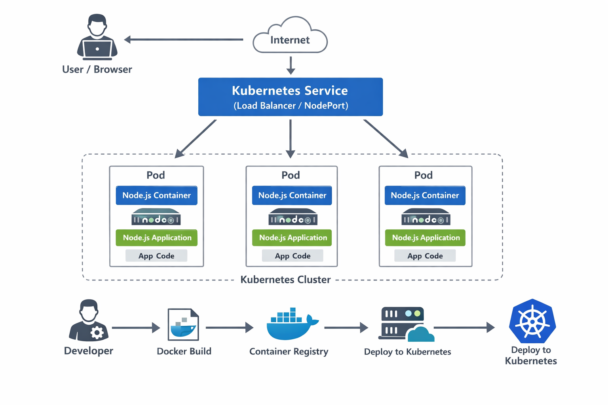

# Node.js Express Application in Kubernetes

A simple Node.js Express application containerized with Docker and deployed to Kubernetes.

## 📋 Table of Contents

- [Features](#-features)
- [Quick Start](#-quick-start)
- [Architecture](#-architecture)
- [Application Endpoints](#-application-endpoints)
- [Configuration](#-configuration)
- [Troubleshooting](#-troubleshooting)

## ✨ Features

- Containerized Node.js Express app using Alpine Linux
- Kubernetes deployment with 5 replicas
- Load balancing via Kubernetes Service
- Health check endpoint (`/health`)
- ES Modules support

## 🚀 Quick Start

### Prerequisites

- Docker
- Kubernetes cluster (Minikube, Docker Desktop, etc.)
- kubectl

### Build & Deploy

```bash
# Build Docker image
docker build -t node-express-app:1.0.0 .

# For Minikube
eval $(minikube docker-env)
docker build -t node-express-app:1.0.0 .

# Deploy to Kubernetes
kubectl apply -f deployment.yaml
kubectl apply -f service.yaml

# Verify
kubectl get pods
kubectl get services

# Access application
kubectl port-forward service/node-express-service 8080:80
# Open http://localhost:8080
```

## 🏗️ Architecture

```
Kubernetes Cluster
    │
    ├── Service (ClusterIP:80)
    │   └── Load Balances Traffic
    │
    └── Deployment (5 Replicas)
        ├── Pod 1 → Node.js App :3000
        ├── Pod 2 → Node.js App :3000
        ├── Pod 3 → Node.js App :3000
        ├── Pod 4 → Node.js App :3000
        └── Pod 5 → Node.js App :3000
```

**Components:**
- **Application**: Express server on port 3000
- **Docker**: `node:alpine` base image
- **Deployment**: 5 pod replicas for high availability
- **Service**: ClusterIP with load balancing



## 🔌 Application Endpoints

| Endpoint | Method | Description |
|----------|--------|-------------|
| `/` | GET | Returns "Hello World, I am Pod <hostname>" |
| `/health` | GET | Returns "OK" (status 200) |

## ⚙️ Configuration

### Docker
- Base Image: `node:alpine`
- Port: `3000`
- Command: `npm start`

### Kubernetes
- **Deployment**: 5 replicas, image `node-express-app:1.0.0`
- **Service**: ClusterIP, port 80 → targetPort 3000

## 🔧 Troubleshooting

```bash
# Check pod status
kubectl get pods
kubectl describe pod <pod-name>
kubectl logs <pod-name>

# Check service
kubectl get services
kubectl describe service node-express-service

# View all resources
kubectl get all -l app=node-express-app-pod
```

**Common Issues:**
- **Image pull errors**: Use `eval $(minikube docker-env)` for Minikube
- **Port conflicts**: Use different port in port-forward command
- **Pods not starting**: Check logs with `kubectl logs <pod-name>`

## 📝 Project Structure

```
├── Dockerfile          # Docker image configuration
├── deployment.yaml     # Kubernetes deployment
├── service.yaml        # Kubernetes service
├── index.mjs           # Express application
└── package.json        # Node.js dependencies
```

## 🧹 Cleanup

```bash
kubectl delete -f deployment.yaml
kubectl delete -f service.yaml
```

---

## 👤 Author

**Belal Mahmoud** - DevOps Engineer

- **GitHub**: [https://github.com/Belal2015](https://github.com/Belal2015)
- **LinkedIn**: [https://www.linkedin.com/in/belal-mahmoud-devops/](https://www.linkedin.com/in/belal-mahmoud-devops/)
- **Email**: belalmahmoud8183@gmail.com

## 📜 License

This project is licensed under the MIT License. See the LICENSE file for details.

---

**Happy Deploying! 🚀**
